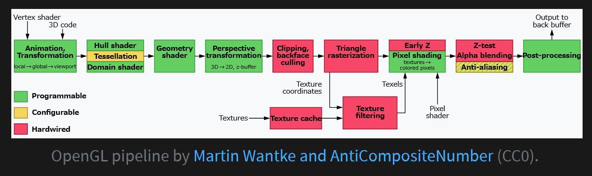

# Shaders

## Overview

## Shaders

- program that run on GPU

## GPU Pipeline

- **vertex shader**
- tesselation
- geometry shader
- clipping
- screen mapping
- triangle stuff
- **fragment shader**
- merger

### Vertex shader

- process the triangle mesh and output a location
- modify, create, ignore values
- NOT create or destroy vertices
- NOT use results from nearby vertices

### Tesselation Stage

- render curved surface
- create path points from information of the begin, end, guide point

### Geometry Shader

- turn primitives into other primitives
  - create a wireframe

### Fragment Shader

- input: interpolated pieces of triangle partially or fully overlapping
- output: color and opacity and $z$-depth
  - able to discard a fragment
  - render to different render targets
- cannot use results from neighboring pixels

### Merging Stage

- determine how fragments are merged
  - depths and colors of fragment are combined in the frame buffer
  - transparency
- usually done before fragment shader to avoid computing non-visible points
- not programmable but very configurable
  - color blending modes
  - alpha blending function
